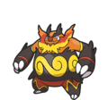

#  Dex 0.6.0

I made these webscraping tools so that Pokemon data can be used for small projects and useful tools. This information is not to be used for profit, but it is available to anyone and everyone who wishes to make something neat under the MIT license. 

It should also be understood that this is NOT my data. It is data created by Nintendo and Game Freak, and collected/harvested by Serebii and PokemonDB.

Please send me links to anything cool to make with this data; I'd love to see it.

#  CSV Data
## Pokedex CSVs
 **[Full Gen 1-9 Pokedex CSV](data/all.csv)**

 [Generation 1 Pokedex CSV](data/gen1.csv)
 [Generation 2 Pokedex CSV](data/gen2.csv)

 [Generation 3 Pokedex CSV](data/gen3.csv)
 [Generation 4 Pokedex CSV](data/gen4.csv)

 [Generation 5 Pokedex CSV](data/gen5.csv)
 [Generation 6 Pokedex CSV](data/gen6.csv)

 [Generation 7 Pokedex CSV](data/gen7.csv)
 [Generation 8 Pokedex CSV](data/gen8.csv)

 [Generation 9 Pokedex CSV](data/gen9.csv)

## Movedex CSVs
 **[Full Gen 1-9 Movedex CSV](data/all_moves.csv)**

 [Generation 1 Movedex CSV](data/gen1-moves.csv)
 [Generation 2 Movedex CSV](data/gen2-moves.csv)

 [Generation 3 Movedex CSV](data/gen3-moves.csv)
 [Generation 4 Movedex CSV](data/gen4-moves.csv)

 [Generation 5 Movedex CSV](data/gen5-moves.csv)
 [Generation 6 Movedex CSV](data/gen6-moves.csv)

 [Generation 7 Movedex CSV](data/gen7-moves.csv)
 [Generation 8 Movedex CSV](data/gen8-moves.csv)

 [Generation 9 Movedex CSV](data/gen9-moves.csv)

#  Usage
## Installation 
1. Use `pip` to install the project dependencies. Make sure you are using the `python3` environment.
2. Clone this project to your local machine

## Dependencies
- BeautifulSoup4
- tqdm

#  References/Sources
- https://www.serebii.net/
- https://pokemondb.net/

#  Licenses
Images and Pokemon are © Nintendo/Creatures Inc./GAME FREAK Inc.

Everything else, and usage of the programming code, is governed by the MIT license.
